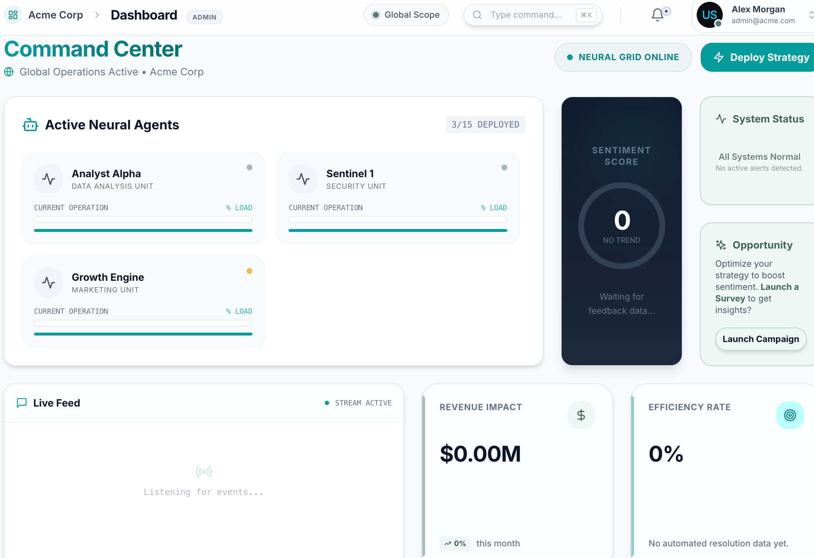
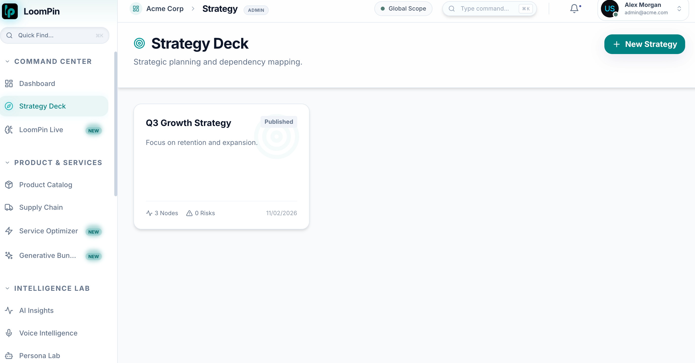

# ০৪. কমান্ড সেন্টার গাইড (Command Center Guide)

আপনি যে ইমেজটি দিয়েছেন সেটি লুম্পিন প্ল্যাটফর্মের **Command Center**। এটি অ্যাপের সবচেয়ে গুরুত্বপূর্ণ পেজ। নিচে এর প্রতিটি অংশের বিস্তারিত কাজ বাংলায় বুঝিয়ে বলা হলো:

### ১. Active Neural Agents (সক্রিয় এআই এজেন্ট)
এখানে আপনি তিনটি বিশেষ এআই এজেন্ট দেখতে পাচ্ছেন যারা সারাক্ষণ কাজ করছে:
- **Analyst Alpha (ডেটা অ্যানালাইসিস)**: আপনার বিজনেসের সব ডেটা বিশ্লেষণ করে ট্রেন্ড খুঁজে বের করে।
- **Sentinel 1 (সিকিউরিটি ইউনিট)**: আপনার সিস্টেমের নিরাপত্তা এবং তথ্যের সুরক্ষা নিশ্চিত করে।
- **Growth Engine (মার্কেটিং ইউনিট)**: কীভাবে ব্যবসার গ্রোথ বাড়ানো যায় এবং কাস্টমারদের কাছে পৌঁছানো যায় তা নিয়ে কাজ করে।
- *লোড বার (% Load)* নির্দেশ করে এই এজেন্টগুলো বর্তমানে কতটা ব্যস্ত।

### ২. Sentiment Score (কাস্টমারদের অনুভূতি)
- এখানে **"0 - NO TREND"** দেখাচ্ছে। কাস্টমাররা পজিটিভ (ভালো) নাকি নেগেটিভ (খারাপ) কথা বলছে, তার গড় হিসাব এখানে রিয়েল-টাইমে দেখা যায়। ডেটা আসা শুরু হলে এখানে স্কোর আপডেট হবে।

### ৩. System Status (সিস্টেমের অবস্থা)
- **All Systems Normal**: এটি জানায় যে আপনার সার্ভার এবং সব সার্ভিস বর্তমানে ঠিকঠাক চলছে। কোনো সমস্যা থাকলে এখানে রেড অ্যালার্ট দেখাবে।

### ৪. Opportunity (সুযোগ ও ক্যাম্পেইন)
- **Launch Campaign**: AI যদি মনে করে এখন নতুন কোনো সুযোগ আছে, তবে সে এখানে পরামর্শ দেয়। যেমন- এখানে একটি সার্ভে (Survey) শুরু করার পরামর্শ দিচ্ছে।

### ৫. Live Feed (সরাসরি আপডেট)
- **Listening for events...**: আপনার সোশ্যাল মিডিয়া বা অন্য সোর্স থেকে যখনই কোনো নতুন ফিডব্যাক আসবে, সেটি এখানে সাথে সাথে মেসেজ আকারে দেখা যাবে।

### ৬. Revenue Impact & Efficiency Rate (আর্থিক এবং দক্ষতা)
- **Revenue Impact ($0.00M)**: AI এর সিদ্ধান্তের ফলে আপনার ব্যবসায় কত টাকা লাভ হয়েছে তার ট্র্যাকিং।
- **Efficiency Rate (0%)**: আপনার অটোমেশন সিস্টেম কতটা দক্ষতার সাথে কাজ করছে তার হিসাব।

---
> [!TIP]
> উপরে ডান দিকে **"Deploy Strategy"** বাটনে ক্লিক করে আপনি নতুন কোনো বিজনেস প্ল্যান কার্যকর করতে পারেন।

আপনার দেওয়া ছবি ডাউনলোড করে আমি `documentation` ফোল্ডারে সেভ করে দিচ্ছি।
# ০৪. কমান্ড সেন্টার গাইড (Command Center - Detailed Guide)

নিচে আপনার প্রজেক্টের **Command Center** বা ড্যাশবোর্ডের প্রতিটি অংশের বিস্তারিত কাজ এবং গুরুত্ব সহজ বাংলায় বুঝিয়ে বলা হলো।

---

## ১. ওভারভিউ এবং লক্ষ্য (Overview & Objective)
কমান্ড সেন্টার হলো লুম্পিন প্ল্যাটফর্মের **মূল কন্ট্রোল রুম**। লগইন করার পর এটিই আপনার প্রথম পেজ।
- **মূল লক্ষ্য**: মাত্র ১০ সেকেন্ডের মধ্যে ব্যবসার বর্তমান অবস্থা (হেলথ চেক) বোঝা এবং দ্রুত কোনো অ্যাকশন নেওয়া।

---

## ২. ব্যবসায়িক গুরুত্ব (Business Value)
- **ব্যবসার জন্য**: এটি ব্যবসায়িক সিদ্ধান্ত নেওয়ার জন্য একটি "সিঙ্গেল উইন্ডো" হিসেবে কাজ করে। ঘণ্টার কাজ কয়েক সেকেন্ডে কমিয়ে আনে।
- **ইউজারদের জন্য**: টেকনিক্যাল জ্ঞান কম থাকলেও যে কেউ AI এজেন্টদের পারফরম্যান্স এবং কাস্টমারদের মনের অবস্থা (Sentiment) বুঝতে পারে।

---

## ৩. বিস্তারিত ইউজার গাইড (User Guide)

- **Agent Fleet Panel (উপরে বামে)**: আপনার কতগুলো AI এজেন্ট বর্তমানে কাজ করছে, তারা কী করছে (Task) এবং তাদের ওপর কাজের চাপ (Load) কেমন, তা এখান থেকে দেখা যায়।
- **Sentiment Score (উপরে মাঝখানে)**: এটি একটি মিটার যা কাস্টমারদের সামগ্রিক অনুভূতি (০-১০০) দেখায়। তারা কি খুশি নাকি অখুশি, তা ট্রেন্ড লাইনের মাধ্যমে বোঝা যায়।
- **Alerts Panel (উপরে ডানে)**: কোনো জরুরি সমস্যা থাকলে এটি লাল (Red) হয়ে যায়। সব ঠিক থাকলে এটি সবুজ (Green) থাকে।
- **Opportunity Card (অ্যালার্টের নিচে)**: এটি AI এর পরামর্শ। যেমন- কাস্টমাররা খুশি থাকলে এটি আপনাকে নতুন কোনো অফার বা ক্যাম্পেইন শুরু করতে বলবে।
- **Live Feed (নিচে বামে)**: সিস্টেমে যা কিছু ঘটছে তার প্রতি মুহূর্তের আপডেট এখানে মেসেজ আকারে আসে।
- **Revenue Impact (নিচে মাঝখানে)**: AI ব্যবহারের ফলে ব্যবসায় আর্থিক লাভ (টাকার হিসাব) কেমন হচ্ছে তা এখানে দেখা যায়।
- **Efficiency Rate (নিচে ডানে)**: আপনার এজেন্টরা কত দ্রুত এবং কার্যকরভাবে কাজগুলো সমাধান করছে তার শতকরা (Percentage) হিসাব।

---

## ৪. ফিচারের তালিকা (Feature Inventory)

### গুরুত্বপূর্ণ বাটনগুলো:
| বাটন | কাজ | স্ট্যাটাস |
| :--- | :--- | :--- |
| **Deploy Strategy** | নতুন কোনো বিজনেস প্ল্যান কার্যকর করা | ✅ চালু আছে |
| **Launch Campaign** | সার্ভিস বা ক্যাম্পেইন শুরু করা | ✅ চালু আছে |
| **View All Alerts** | সব সমস্যাগুলো বিস্তারিত দেখা | ✅ চালু আছে |

### ডেটা সোর্স (কোথা থেকে তথ্য আসে):
- **Agent Data**: সরাসরি AI Orchestrator থেকে আসে। (প্রতি ৩০ সেকেন্ডে আপডেট হয়)
- **Live Feed**: সিস্টেমের ইভেন্ট লগ থেকে আসে। (প্রতি ১৫ সেকেন্ডে আপডেট হয়)
- **Metrics**: ডেটাবেসের স্ট্যাটিস্টিকস থেকে হিসাব করা হয়।

---

## ৫. বর্তমান সীমাবদ্ধতা ও ভবিষ্যৎ পরিকল্পনা (Gap Analysis)

বর্তমানে কিছু জায়গায় কাজ চলছে:
- **Metrics অটো-রিফ্রেশ**: বর্তমানে কিছু মিটার পেজ রিলোড না করলে আপডেট হয় না, এটি ভবিষ্যতে অটোমেটিক করার কাজ চলছে।
- **মোবাইল ভিউ**: এই ড্যাশবোর্ডটি কম্পিউটারে ভালো চললেও মোবাইলে দেখার জন্য আরও উন্নত করার প্রয়োজন আছে।
- **WebSocket**: ডেটাগুলো আরও দ্রুত (রিয়েল-টাইম) পাওয়ার জন্য নতুন টেকনোলজি যোগ করার প্ল্যান রয়েছে।

---
> [!NOTE]
> কোডিং লেভেলে এই পেজটি `BrandAdminDashboardV2.tsx` কম্পোনেন্ট দ্বারা নিয়ন্ত্রিত হয়।

# ০৫. স্ট্র্যাটেজি ডেক গাইড (Strategy Deck Guide)

আপনি যে দ্বিতীয় ইমেজটি দিয়েছেন সেটি লুম্পিন প্ল্যাটফর্মের **Strategy Deck** পেজ। এটি মূলত আপনার ব্যবসার দীর্ঘমেয়াদী পরিকল্পনা এবং কৌশল সাজানোর জায়গা। নিচে এর প্রতিটি অংশের বিস্তারিত কাজ বাংলায় বুঝিয়ে বলা হলো:

### ১. সাইডবার (Sidebar - বাম পাশে)
বাম পাশের মেনু থেকে আপনি অ্যাপের বিভিন্ন সেকশনে যেতে পারেন:
- **COMMAND CENTER**: ড্যাশবোর্ড, স্ট্র্যাটেজি ডেক এবং লাইভ ফিড।
- **PRODUCT & SERVICES**: পণ্যের তালিকা, সাপ্লাই চেইন এবং সার্ভিস অপ্টিমাইজার।
- **INTELLIGENCE LAB**: AI এর মাধ্যমে প্রাপ্ত ইনসাইট এবং কাস্টমার পারসোনা।

### ২. Strategy Deck (মূল অংশ)
এখানে আপনার ব্যবসার সব কৌশল (Strategy) বা প্ল্যানগুলো কার্ড আকারে সাজানো থাকে। ইমেজে একটি **"Q3 Growth Strategy"** কার্ড দেখা যাচ্ছে।

- **Published Tag**: এটি নির্দেশ করে যে এই প্ল্যানটি বর্তমানে লাইভ বা কার্যকর আছে।
- **Strategy Description**: প্ল্যানটির মূল ফোকাস কী (যেমন: retention and expansion) তা এখানে লেখা থাকে।
- **Stats (নিচে বামে)**: 
    - **3 Nodes**: এই প্ল্যানটির অধীনে ৩টি প্রধান ধাপ বা অংশ আছে।
    - **0 Risks**: বর্তমানে এই প্ল্যানে কোনো বিপত্তি বা ঝুঁকি শনাক্ত হয়নি।

### ৩. New Strategy (বাটন - উপরে ডানে)
- **+ New Strategy**: এই বাটনে ক্লিক করে আপনি নতুন কোনো ব্যবসায়িক পরিকল্পনা বা নতুন কোয়ার্টারের জন্য স্ট্র্যাটেজি তৈরি করতে পারেন।

### ৪. সার্চ এবং নেভিগেশন (উপরে)
- **Quick Find**: যেকোনো কিছু দ্রুত খুঁজে পাওয়ার জন্য সার্চ বার।
- **Global Scope**: আপনি বর্তমানে পুরো প্রজেক্টের ভিউতে আছেন তা বোঝায়।

---

## এই পেজটি কেন ব্যবহার করবেন?
- ব্যবসার লক্ষ্য স্থির করতে।
- কোন কাজটির পর কোনটি করতে হবে (Dependency mapping) তা বুঝতে।
- ব্যবসার ঝুঁকির হার (Risk assessment) নিয়মিত মনিটর করতে।

> [!NOTE]
> কোডিং লেভেলে এই পেজটি `StrategyDashboard.tsx` কম্পোনেন্ট দ্বারা পরিচালিত হয়।

## ২. স্ট্র্যাটেজি ডেক (Strategy Deck - Detailed)

এই পেজটি মূলত আপনার ব্যবসার দীর্ঘমেয়াদী পরিকল্পনা এবং কৌশল সাজানোর জন্য একটি **ভিজুয়াল ক্যানভাস (Visual Canvas)**।

### ২.১ ওভারভিউ এবং লক্ষ্য (Overview & Objective)
এটি একটি ড্র্যাগ-এন্ড-ড্রপ ইন্টারফেস যেখানে আপনি আপনার ব্যবসার লক্ষ্যগুলো (Objectives) ম্যাপের মতো সাজাতে পারেন। এখানে AI নিজে থেকেই নতুন স্ট্র্যাটেজি তৈরি করে দিতে পারে।

### ২.২ ব্যবসায়িক গুরুত্ব (Business Value)
- **পরিকল্পনা**: খাতা-কলমে দীর্ঘ আলোচনার বদলে এখানে ম্যাপের মাধ্যমে দ্রুত প্ল্যান করা যায়।
- **AI সাহায্য**: আপনার ইনপুট অনুযায়ী AI কয়েক মিনিটের মধ্যে পূর্ণাঙ্গ স্ট্র্যাটেজি তৈরি করে দেয়।
- **মনিটরিং**: আপনার প্ল্যানগুলো কাস্টমারের প্রতিক্রিয়ার (VoC Data) ওপর ভিত্তি করে কতটা কাজ করছে তা সরাসরি ট্র্যাক করা যায়।

### ২.৩ ইউজার গাইড (User Guide - কীভাবে ব্যবহার করবেন)
১. **Deck Selector**: নতুন স্ট্র্যাটেজি ডেক তৈরি বা পুরনোটিতে ফিরে যাওয়ার জন্য।
২. **Canvas Area**: মাঝখানের ফাঁকা জায়গায় আপনি আপনার লক্ষ্যগুলো (Nodes) ড্র্যাগ করে সাজাতে পারেন।
৩. **AI Chat Panel**: ডানে থাকা চ্যাট বক্সে AI কে স্ট্র্যাটেজি তৈরি বা ঝুঁকি (Risk) বিশ্লেষণের নির্দেশ দিতে পারেন।
৪. **Inbox Panel**: AI যখন নিজে থেকে কোনো প্রস্তাব দেয়, তা এখানে জমা থাকে। আপনি চাইলে তা ক্যানভাসে যোগ করতে পারেন।
৫. **Inspector Panel**: যেকোনো নোড (Node) ক্লিক করে তার নাম, বর্ণনা বা শেষ তারিখ পরিবর্তন করা যায়।
৬. **Save & Monitor**: আপনার কাজ সেভ করতে বা বর্তমান প্ল্যানটি কতটা সফল হচ্ছে তা চেক করতে মনিটর বাটন ব্যবহার করুন।

### ২.৪ ফিচারের তালিকা (Feature Inventory)

**বাটন এবং অ্যাকশন:**
- **Create/Save/Delete**: আপনার প্ল্যানগুলো তৈরি, সেভ বা মুছে ফেলার জন্য।
- **AI Generate & Simulate**: AI এর মাধ্যমে নতুন প্ল্যান তৈরি করা বা ভবিষ্যতে কী হতে পারে তার সিমুলেশন চালানো।
- **Tactics**: কোনো স্ট্র্যাটেজি বাস্তবায়নের জন্য ছোট ছোট ধাপ বা কৌশল জেনে নেওয়া।

**ডেটা সোর্স (কোথা থেকে তথ্য আসে):**
- **Strategy API**: আপনার তৈরি করা ম্যাপগুলো ডেটাবেসে রাখার জন্য।
- **Gemini AI**: স্ট্র্যাটেজি বা আইডিয়া জেনারেট করার জন্য।
- **VoC Insights**: কাস্টমারদের ফিডব্যাক থেকে সরাসরি মনিটরিং করার জন্য।

### ২.৫ বর্তমান সীমাবদ্ধতা ও ভবিষ্যৎ পরিকল্পনা (Gap Analysis)
- **উন্নত সেভ সিস্টেম**: বর্তমানে ড্র্যাগ করলে সাথে সাথে সেভ হয় না, ভবিষ্যতে এটি অটো-সেভ করার পরিকল্পনা রয়েছে।
- **ভুল সংশোধনের সুবিধা (Undo/Redo)**: ক্যানভাসে কোনো ভুল করলে তা আগের অবস্থায় ফিরিয়ে নেওয়ার সুবিধা যোগ করার কাজ চলছে।
- **ডেটা কানেকশন**: স্ট্র্যাটেজির সাথে আসল কাস্টমার ডেটা (VoC Data) আরও গভীরভাবে যুক্ত করার কাজ চলছে যাতে AI আরও নিখুঁত পরামর্শ দিতে পারে।

### ২.৬ সিস্টেম আর্কিটেকচার (System Architecture)
এটি একটি জটিল সিস্টেম যা অনেকগুলো ধাপ মেনে কাজ করে:
১. **Frontend**: আপনার স্ক্রিনে আপনি যা দেখেন (React Flow ব্যবহার করে)।
২. **Backend API**: আপনার সব নির্দেশ সার্ভারে পাঠায়।
৩. **Intelligence Layer**: এখানে Gemini AI এবং লুম্পিনের নিজস্ব অ্যালগরিদম কাজ করে আপনার ডেটা বিশ্লেষণ করার জন্য।
৪. **Database**: আপনার সব ডাটা (Project, Metrics, Insights) নিরাপদে জমা রাখে।

---
> [!IMPORTANT]
> এই পেজটি মূলত ব্যবসার বড় সিদ্ধান্তগুলোকে সহজ এবং ভিজ্যুয়াল করার জন্য তৈরি করা হয়েছে। কোডিং লেভেলে এটি `StrategyDeck.tsx` ফাইল দ্বারা পরিচালিত হয়।
