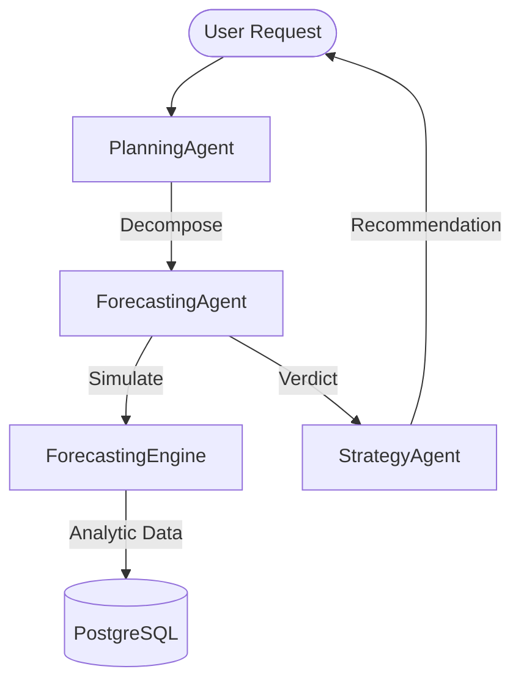

# ForecastingAgent: The Strategic Foresight Engine

The `ForecastingAgent` is the **Predictive Intelligence** component of the Loompin Neural Core. Unlike standard agents that reflect on past data, the ForecastingAgent is designed to simulate potential futures, identify risks before they manifest, and validate strategic roadmaps.

## 1. Core Identity & Mission
*   **Squad:** `strategy` (Member of the Strategic Intelligence Squad)
*   **Role:** Moving from **Reactive** (What happened?) to **Predictive** (What will happen?) and **Prescriptive** (What should we do based on the prediction?).
*   **Agent ID:** `agent_forecast_01`

---

## 2. Cognitive Architecture: "How it Thinks"
The agent implements the **6-Stage SmartAgent Loop**, a proprietary cognitive flow that ensures high-confidence results.

### Stage 1: Recall (Episodic Memory)
Before analyzing a new request, it queries the `vectorStore` for similar past forecasting "episodes." It checks:
- "What did I predict last time NPS dropped?"
- "Was that prediction accurate?"

### Stage 2: Contextualization
It identifies the target **Metric** (NPS, Churn, Sentiment) and the **Horizon** (30, 60, or 90 days). It pulls 12 months of historical baseline data from the database.

### Stage 3: Hypothesization
It generates theoretical outcomes:
- **Trend Forecast:** Baseline projection based on current momentum.
- **Strategic Drift:** Identifying if the company is moving away from its goals.
- **Black Swan Events:** Potential high-risk, low-probability disruptions.

### Stage 4: Investigation (The Sandbox)
This is its "thinking" phase. It uses the `sandboxService` to execute dynamic code and interacts with:
- **[ForecastingEngine](file:///Users/user/Desktop/PC/anti%20gravity%20projects/loompin/loompin_VoC/backend/services/ForecastingEngine.js):** Runs Linear Regression/Holt-Winters models.
- **Gemini 1.5 Pro:** Used for "Causal Inference"—determining if a 10% faster response time will actually yield a 5-point NPS lift based on industry patterns.

### Stage 5: Synthesis
It formulates the **Verdict**. It provides:
- **Veracity Score:** Its own confidence in the prediction.
- **Action Items:** Direct triggers for the `StrategyAgent`.
- **Narrative:** Simple explanation of "Why" the future looks this way.

### Stage 6: Self-Correction (Zenith Hallucination Protocol)
It runs a final check on itself. If it claims a high-impact forecast without specific data evidence in its context, it resets the synthesis to avoid "AI Over-Optimism."

---

## 3. System Links & Orchestration
The `ForecastingAgent` is a high-level collaborator linked to several key components:

### Orchestration Path

### Key Integrations
1.  **[StrategyAgent](file:///Users/user/Desktop/PC/anti%20gravity%20projects/loompin/loompin_VoC/backend/agents/squads/StrategyAgent.js):** The ForecastingAgent acts as the "Science Lab" for the StrategyAgent. When the StrategyAgent wants to generate a "Next Best Action," it asks the ForecastingAgent for the potential ROI.
2.  **[ScenarioService](file:///Users/user/Desktop/PC/anti%20gravity%20projects/loompin/loompin_VoC/backend/services/ScenarioService.js):** The bridge to the UI. When a user tweaks a slider on the dashboard, this service triggers the agent's simulation logic.
3.  **[PredictiveService](file:///Users/user/Desktop/PC/anti%20gravity%20projects/loompin/loompin_VoC/backend/services/predictiveService.js):** Provides specific "Low-Level" forecasts like Churn Risk and Lifetime Value (LTV) which the agent aggregates into its higher-level strategy reports.

---

## 4. Key Capabilities
*   **"What-If" Analysis:** Simulates the ripple effect of changing internal drivers (e.g., support speed, product bugs).
*   **Trend Velocity Tracking:** Measures not just if a metric is up or down, but how fast it is changing.
*   **Industry Benchmarking:** Uses LLM knowledge to compare tenant data against SaaS or Retail standards.
