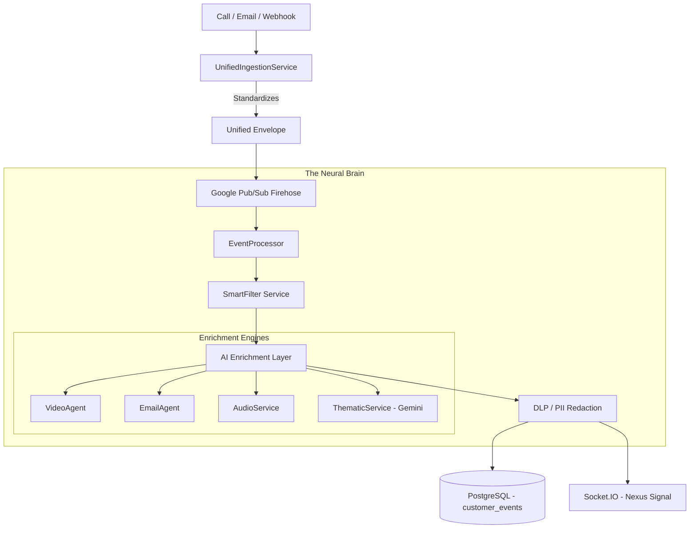
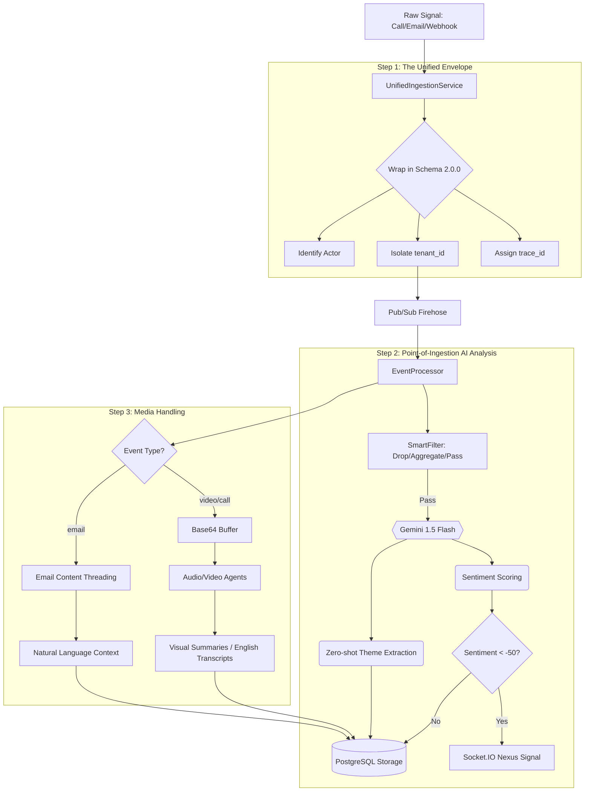

# Deep-Dive: Neural Core Ingestion & Analysis

The Neural Core is the "Central Nervous System" of Loompin. It transforms raw, chaotic data (emails, calls, webhooks) into structured, actionable intelligence.

## 🏗️ The Data Pipeline (Mermaid)

## 📂 Directory & File Map

| Phase | Path | Responsibility |
| :--- | :--- | :--- |
| **Ingestion** | [backend/services/UnifiedIngestionService.js](file:///Users/user/Desktop/PC/anti%20gravity%20projects/loompin/loompin_VoC/backend/services/UnifiedIngestionService.js) | Enforces the "Unified Envelope" (Standard Header/Metadata). |
| **Transport** | [backend/services/PubSubService.js](file:///Users/user/Desktop/PC/anti%20gravity%20projects/loompin/loompin_VoC/backend/services/PubSubService.js) | Asynchronous decoupled transport using Google Pub/Sub. |
| **Orchestration** | [backend/services/EventProcessor.js](file:///Users/user/Desktop/PC/anti%20gravity%20projects/loompin/loompin_VoC/backend/services/EventProcessor.js) | The pipeline brain: coordinates filtering, enrichment, and redaction. |
| **AI Analysis** | [backend/services/neural-core/processing/ThematicService.js](file:///Users/user/Desktop/PC/anti%20gravity%20projects/loompin/loompin_VoC/backend/services/neural-core/processing/ThematicService.js) | Uses **Gemini 1.5 Flash** for theme driver and keyword extraction. |
| **Safety** | [backend/services/dlp.js](file:///Users/user/Desktop/PC/anti%20gravity%20projects/loompin/loompin_VoC/backend/services/dlp.js) | Uses **Google Cloud DLP** for real-time find-and-redact of PII. |
| **Media Agents** | `backend/agents/` | Specialized agents for Video, Email, and Audio transcription. |

## 🔄 The Logic Flow Flowchart

This diagram visualizes the precise decision-making and transformation logic described below:

## 🧠 The Logic Flow (Details)

### 1. The "Unified Envelope" Standard
Every signal that enters Loompin is wrapped in a 2.0.0 schema envelope. This ensures that whether it's an NPS score or a 10-minute call, the system sees:
- `trace_id`: Universal ID for tracing a single interaction.
- `tenant_id`: For strict multi-tenant data isolation.
- `actor`: Identification of who (customer/system) triggered the event.

### 2. Point-of-Ingestion AI Analysis
Unlike legacy systems that analyze "nightly", Loompin analyzes at the **Point of Ingestion**. 
In `EventProcessor.js` and `ThematicService.js`:
- **Sentiment Scoring**: Real-time extraction of emotional state.
- **Theme Extraction**: Identifying if a call is about "Pricing" vs "UX Bug" via Zero-shot classification.
- **Nexus Loop**: If sentiment is critical (< -50), it triggers a `nexus-signal` via WebSockets to the live dashboard *before* it even hits the permanent database.

## 📂 Supported Data Sources (The "Input Network")

The Neural Core is designed for **Omni-Channel Mastery**. It is not limited to just a few sources; it is an extensible network of connectors:

### 1. Enterprise Ecosystems (Pre-built Connectors)
- **Jira**: Ingests tickets, status changes, and developer comments.
- **Salesforce**: Synchronizes accounts, opportunities, and CRM signals.
- **Zendesk**: Real-time ingestion of support tickets and chat transcripts.

### 2. Physical & Digital Channels
- **Voice/Audio**: `call_recording` events with base64 buffers (powered by `audioService`).
- **Video**: `video_interaction` analysis for visual sentiment and duration (powered by `VideoAgent`).
- **Email**: `email_thread` ingestion for long-form context (powered by `EmailAgent`).

### 3. Programmable Entry Points
- **REST API (`/ingest/v2`)**: A high-velocity endpoint for custom internal applications.
- **Universal Webhooks**: A flexible receiver for any third-party tool (Slack, Shopify, Custom apps).
- **Universal Database Connector**: Allows the system to reach out and "pull" signals directly from Client SQL/NoSQL databases.

### 4. Behavioral & Market Signals
- **Transactions**: `order_placed` events for revenue-weighted impact analysis.
- **Surveys**: Conversational and structured survey responses.
- **Market Scanner**: Live web-scraping for competitor pricing and news.
- **Telemetry**: Real-time ingestion of frontend logs and navigation patterns.

### 3. Media Handling
- **Video/Audio**: Ingested as base64 buffers, sent to `audioService` or `VideoAgent`, and returned as "English Translations" and "Visual Summaries".
- **Email**: `EmailAgent` threads subjects and bodies to understand the "Story" behind a chain.
